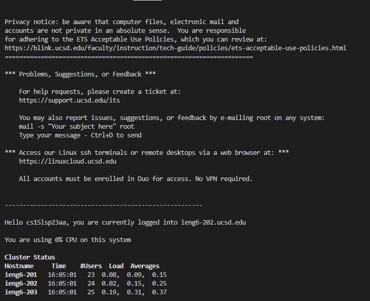

1. Installing Visual Studio Code:
For this first step, I did not need to install Visual Studio Code because it was already installed on my computer. But, to install Visual Studio Code, I would need to download the Visual Studio Code installer for Windows with this link: [https://code.visualstudio.com/download](https://code.visualstudio.com/download) and then run the installer by selecting the Visual Studio Code installer from the start menu. After the program finishes installing, I should be able open it up to this page: 

2. Remotely Connecting:
I did not need to install git for Windows, but I would install it by clicking this link: [https://git-scm.com/](https://git-scm.com/). First I have to click downloads, and then click downloads for windows and put git on my desktop folder. To install git, I would have to open it up and click install git. After git was installed on my computer, I set my terminal in Visual Studio code to git bash and type ssh and my course account in the terminal, which would look like this: 'ssh cs15lsp23aa@ieng6.ucsd.edu. The terminal had a message pop up on my screen, asking me if I wanted to connect to the server. I typed yes and I had to input my password from my course account. Since I just created a password I had to wait a while to input my password. My screen had this message pop up after the password was typed:

3. Trying Some Commands:
In the terminal I tried using some commands like, 'cd ~, 'cd, and 'ls -lat. The command 'cd allows me to change to another directory. For example, I can type 'cd Users and then type cd and a username like 'cd kirst the terminal will show C:\Users\kirst> which means I am in that directory. However, instead of using just 'cd to access a folder, you can use 'cd ~ to access a project name without the username. For example, typing 'cd ~/projectname/  and it will move you to that directory. Nothing in the terminal will pop up if the commands 'cd and 'cd ~ are typed by itself. When I typed the command 'ls -lat, I had many directories and files pop up on my screen (which is shown in the image below). The command 'ls -lat is a linux command. After trying different commands, I used Ctrl-D and typed the exit command to log out of the remote server.

