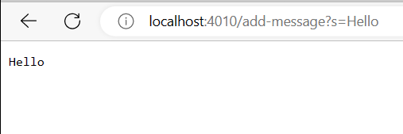

## Kirsten Bali

# Lab Report: Bugs and Servers

## Part 1: Web Server

Code for StringServer:
    
    class Handler implements URLHandler{
        String newStr = "";
       
        public String handleRequest(URI url) {
            System.out.println("Path: " + url.getPath());
            if (url.getPath().contains("/add")) {
                String[] parameters = url.getQuery().split("=");
                if (parameters[0].equals("s")) {
                    newStr += parameters[1];
                    newStr += "\n";
                    return String.format("%s\n", newStr);
                }
             }
             return "404 Not Found!";
         }
      }
      
      class StringServer {
        public static void main(String[] args) throws IOException {
            if (args.length == 0) {
                System.out.println("Missing port number!
                    Try any number between 1024 and 49151");
                return;
            }
            int port = Integer.parseInt(args[0]);
            Server.start(port, newHandler());
        }
      }

  

In the code above the method handleRequest() is called, and the argument to the method is the URI url. The url path gets checked in the first if statement, and the contains() method is called to see if the url has the path "/add". The getQuery() method looks at the query which is the part of the url after the ? and before the anchor. When it looks at the query, the method split() gets called and uses "=" as the delimeter of the string. When the string is split, it puts the string elements that are before and after the delimeter into a list. So the first element of the list should be "s" and the second element would be the string after the "=". The "\n" is used to add a new line to the page. It makes sure that each string is in its own line. The field was orginally `int num` in the code, but got changed to `String newStr` because it adds words to the website page now instead of numbers. Using the `+=` operation, allows the string to be concatenated to the page and won't replace a string with the newly added string. To use "/add" in the url type "/add?s=word" without quotes. You can replace "word" with any string you like you like. To add another string after that, just again replace that string with another string as shown in the image above. 

## Part 2: Bugs and Fixes

A failure inducing input for the method reversed():

    int[] input1 = {3, 2, 1};
    assertArrayEquals(new int[]{1, 2, 3}, ArrayExamples.reversed(input1));
    
An input that doesn't induce a failure for the method reversed():

    int[] input1 = { };
    assertArrayEquals(new int[]{ }, ArrayExamples.reversed(input1));
    
The symptom as the output of running the tests:

The before code of the method reversed(): 

    static int[] reversed(int[] arr) {
        int[] newArray = new int[arr.length];
        for(int i = 0; i < arr.length; i += 1) {
            arr[i] = newArray[arr.length - i - 1];
        }
        return arr;
    }

The after code of the method reversed():

    static int[] reversed(int[] arr) {
        int[] newArray = new int[arr.length];
        int temp;
        for(int i = 0; i < arr.length; i += 1) {
            newArray[i] = arr[arr.length - i - 1];
        }
        return newArray;
    }

Changing `arr[i] = newArray[arr.length-i-1]` to `newArray[i] = arr[arr.length-i-1]` and returning `arr` instead of `newArray` addresses the issue because the orginal code was origially returning an empty array. The array `newArray` orginially did not have any elements in it, so getting an element from `newArray` and initializing `arr[i]` to that element would actually mean the value is null. Initializing `newArray[i]` to `arr[arr.length-i-1]` means the first element in the empty array is set to the first element in the original array. The `newArray` that was originally empty becomes the reversed array of `arr`, so returning that array means the tests will pass.

## Part 3: What I learned

I learned that every URL has a port, and it can be any number that has not been taken already. My partner and I tried to use 6025 but could not figure out why our website would not load. We found out that it was because that number was taken already, so we changed it to 4739. Changing our port allowed our website to load. It was interesting to see how a unique port is essential to deploying a web server.
