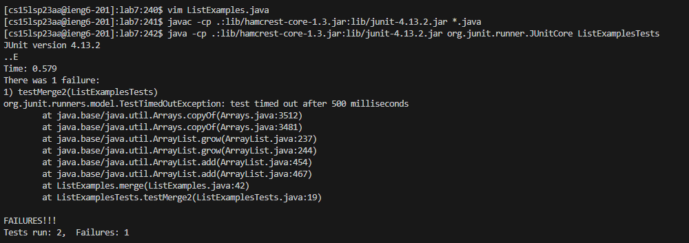

#### Kirsten Bali

# Lab Report 4

### 1. Log into ieng6

First I set my default terminal to git bash and typed in the terminal line `ssh cs15lsp23aa@ieng6.ucsd.edu` <enter>. Then I typed in my password and pressed enter to login. After I logged in, the image above shows what was displayed on my screen in the terminal.

  
### 2. Clone the Repository from Github 

To clone this repsoitory, I first typed `ls` to see which which directory I was in and typed `cd <ilename>`, so I can clone the repository in the directory I want to. After that I typed `git clone https://github.com/ucsd-cse15l-s23/lab7` and pressed enter to clone the repository. The image above shows that the repository was successfully cloned.

  
### 3. Run the Tests

To compile the code in the lab7 file, I ran the comman line `javac -cp .:lib/hamcrest-core-1.3.jar:lib/junit-4.13.2.jar *.java` and ran the tests by using the command line `java -cp .:lib/hamcrest-core-1.3.jar:lib/junit-4.13.2.jar org.junit.runner.JUnitCore ListExamplesTests` in the terminal. After the code compiles and runs, it should show on the screen that the tests fail as shown in the image above.

### 4. Fix the Failing Tests

  

