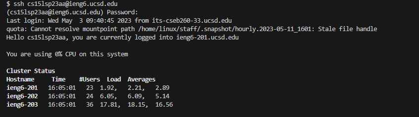
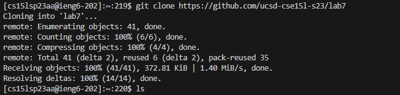

#### Kirsten Bali

# Lab Rport 4

### Log into ieng6

First I set my default terminal to git bash and typed in the terminal line `ssh cs15lsp23aa@ieng6.ucsd.edu` <enter>. Then I typed in my password and pressed enter to login. After I logged in, the image above shows what was displayed on my screen in the terminal.

### Clone the fork of the Repository from Github 

  

