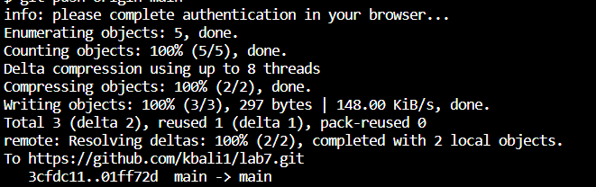

#### Kirsten Bali

# Lab Report 4

### 1. Log into ieng6

First I set my default terminal to git bash and typed in the terminal line `ssh cs15lsp23aa@ieng6.ucsd.edu <enter>`. Then I typed in my password and pressed enter to login. After I logged in, the image above shows what was displayed on my screen in the terminal.

  
### 2. Clone the Repository from Github 

To clone this repsoitory, I first typed `ls` to see which which directory I was in and typed `cd` and the file name, so I can clone the repository in the directory I want to. Then I typed `git clone https://github.com/ucsd-cse15l-s23/lab7 <enter>` to clone the repository. The image above shows that the repository was successfully cloned.

  
### 3. Run the Tests

To compile the code in the lab7 file, I ran the command line `javac -cp .:lib/hamcrest-core-1.3.jar:lib/junit-4.13.2.jar *.java <enter>` and ran the tests by using the command line `java -cp .:lib/hamcrest-core-1.3.jar:lib/junit-4.13.2.jar org.junit.runner.JUnitCore ListExamplesTests <enter>` in the terminal. After the code compiles and runs, it should show that the tests fail, which is shown in the image above.

### 4. Fix the Failing Tests

  
To fix the failing tests, edit the file `ListExamples.java`. I edited this file by using vim and running the command lim `vim ListExamples <enter>`. The terminal opened it up on vim. The screen that should appear in the terminal is shown in the image above. To edit the code on vim, press these keys: `<esc><j>x42<i><l>x12<2><backspace><esc><:wq>`. Pressing `<esc>` button makes sure that vim is in normal mode. The `<j>` moves the cursor down to the line where it shows `index1 += 1` in the last while loop. The `<i>` changes vim to insert mode so `<l>` can be pressed 12 times to move the cursor to the right 12 times. Pushing the number `<2>` on the keyborad and the backspace button allows `index1` to be changed to `index2`. Pressing `<esc>` puts vim back into normal mode. To save changes and exit vim, type `<:wq>` while vim is in normal mode.

### 5. Run the Tests Again

Like in step 3, to compile the code run the command line in the terminal, type `javac -cp .:lib/hamcrest-core-1.3.jar:lib/junit-4.13.2.jar *.java <enter>` and `java -cp .:lib/hamcrest-core-1.3.jar:lib/junit-4.13.2.jar org.junit.runner.JUnitCore ListExamplesTests <enter>`. The screen should show that the tests passed after it runs.

  
### 6. Commit and Push Changes

I was unable to complete the last step due to an error in generating an ssh key for github, so I could not push changes through my course account. The result of pushing the changes should be shown in the third image above. Before committing and pushing the changes, I first have to type the command `git add * <enter>` to update the chnages in my directory. Then I would type the command `git commit -m "edit lab7" <enter>` and `git push origin main <enter>` to commit and push changes. The message does not have to be "edit lab7." It can be anything as long as it is in quotes in the commit command line. The branch does not have to be main in the push command line. It just has to be a brach name. But the file is already in the main branch so it is best that I use main. 
