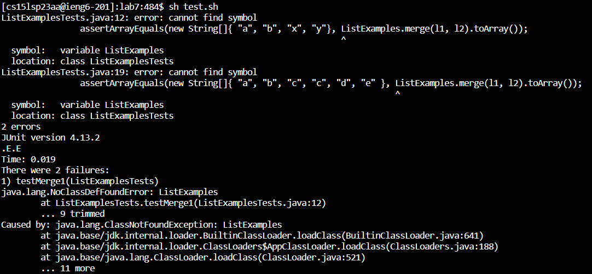
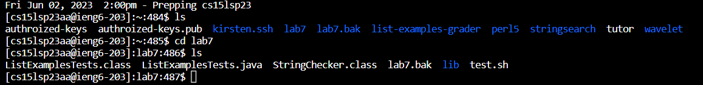

#### Kirsten Bali
# Lab Report 5

## Debugging Scenario
### 1. Post From Student
**What environment are you using (computer, operating system, web browser, terminal/editor, and so on)?**

I am using the VSCode terminal on my windows laptop.

**Detail the symptom you're seeing. Be specific; include both what you're seeing and what you expected to see instead. Screenshots are great, copy-pasted terminal output is also great. Avoid saying “it doesn't work”.**

I know I am suppose to see one failure in ListExamplesTest class when I run and compile:

Even though the expected output shows in the terminal, I am also seeing another failure:

**Detail the failure-inducing input and context. That might mean any or all of the command you're running, a test case, command-line arguments, working directory, even the last few commands you ran. Do your best to provide as much context as you can.**

It says the class is not found. But I am pretty sure I saw the ListExamplesTest class in the lab7 directory. I ran the command `sh test.sh` in the terminal to compile and run my code. What may be the problem?

### 2. Response From TA
Have you tried typing `ls` to see what files are in your lab7 directory?

### 3. The Bug

The student does not have the files ListExamples.java and ListExamples.class in their lab7 folder.

### 4. How To Fix the Bug
The lab7 directory must have the files ListExamplesTests.java, ListExamples.java, test.sh, and the lib folder. But the student does not have the file ListExamples.java. The student ran the line `sh test.sh`, which is what they are suppose to do to show the correct output. The bash script contains the compile and run commands `javac -cp .:lib/hamcrest-core-1.3.jar:lib/junit-4.13.2.jar *.java` and `java -cp .:lib/hamcrest-core-1.3.jar:lib/junit-4.13.2.jar org.junit.runner.JUnitCore ListExamplesTests`. The student needs to figure out which folder the file ListExamples.java is in and move it back into the lab7 directory, or they can git clone another lab7 repository and run the line `sh test.sh` again to have the correct output.

## Reflection
I did not know you could make a bash script of code you want to input in a terminal and run that script in the terminal. I always thought that the code must be run through the terminal in order for the files to compile and run. I thought that writing the if statement in bash script was especially interesting. In Lab 6, my partner and I wrote the if statemnet to check if a file was in the right directory, and then the terminal would show "Good job!" if the if statement was true. This was just like writing code in a program, but in a different way, which I thought was cool. Before this class Command Prompt and Git Bash terminal languages and syntax were foreign to me, but now I understand how to use the terminal commands and what to commands to research to make my files run and work.
